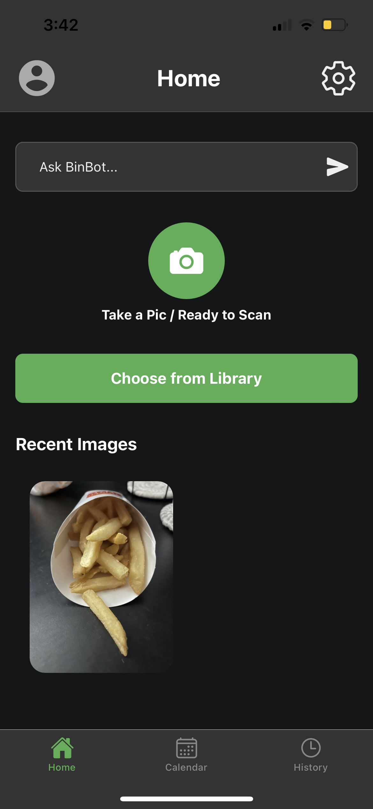
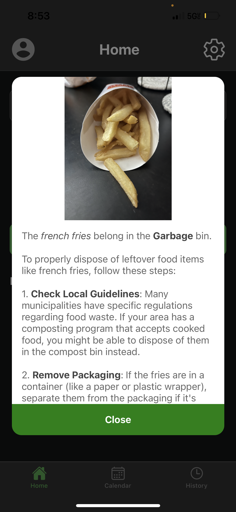
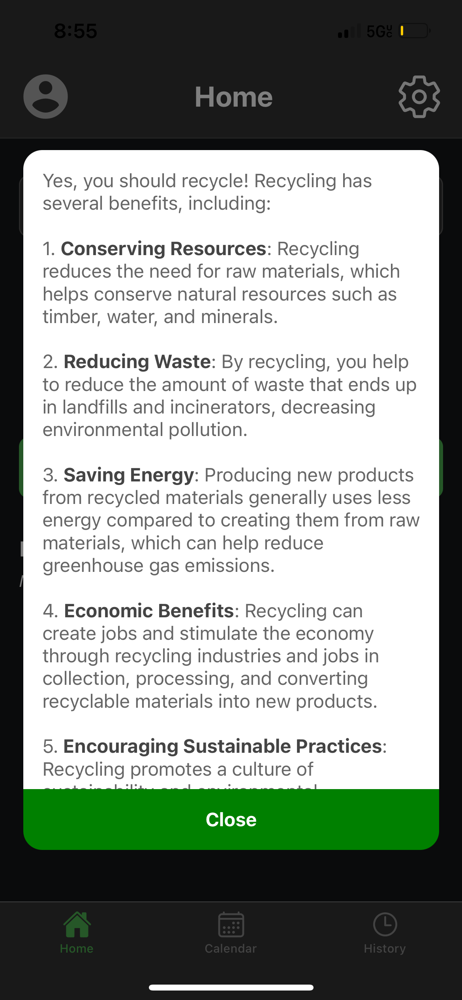
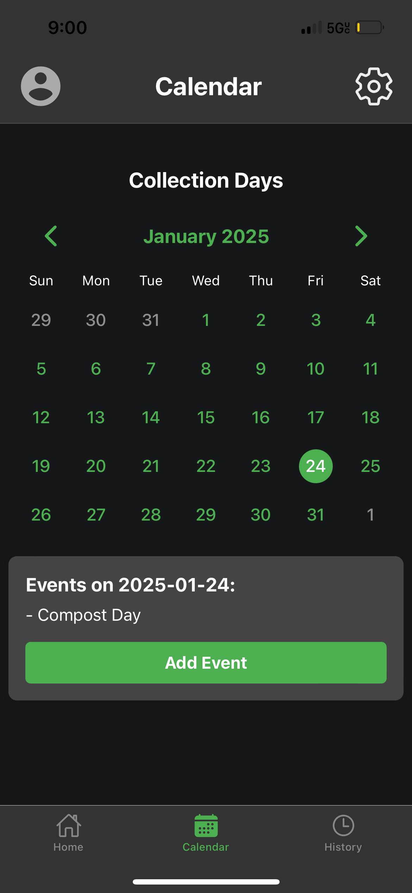
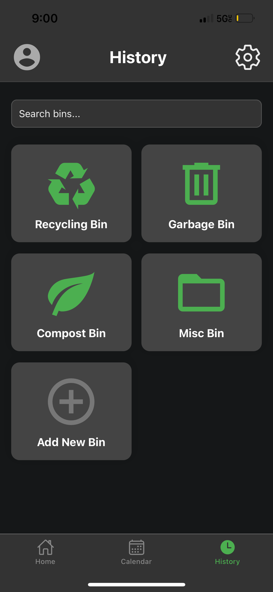
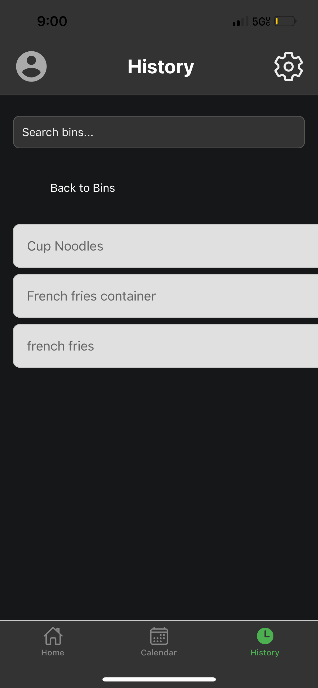
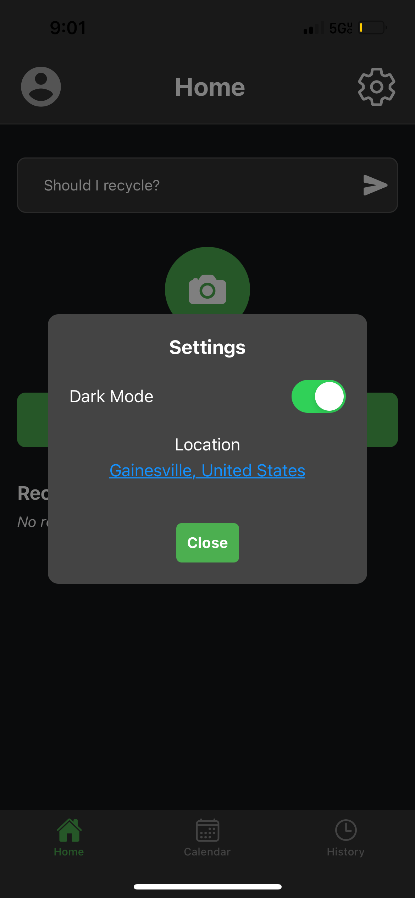
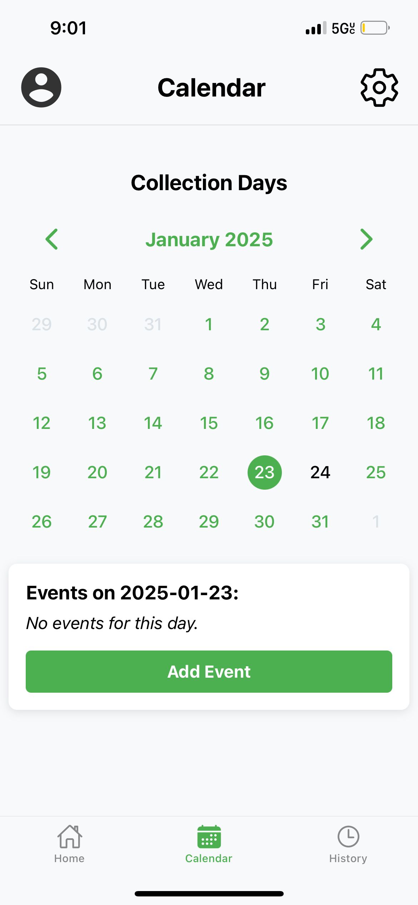

# Recyclyze

## What is it
Recyclyze is a responsive **cross-platform mobile application** created to aid people in learning how to properly sort and dispose of their waste, as well as keep track of what days different types of waste are collected.

Users can **ask BinBot** any waste disposal, reduction, reuse, recycling, etc., related questions. By taking a picture through the app or selecting a photo from their gallery of waste, users can also get information on proper disposal methods.

**Location** can be set in the settings under the light/dark mode toggle. Images will then automatically take location into account when returning information on waste disposal.

The built-in **Calendar** allows events such as different collection days to be saved (will be able to send reminders soon).

There is a **history screen** where all the responses for analyzed images and search prompts will be accessible and able to be viewed again (responses are pre-sorted into Recycling, Garbage, Compost, and other categories).

## Demo

  
  
  
  
  
  
  
  

## Tools Used
- React Native
- Expo
- OpenAI (Vision & Text Generation) API
- SQLite
- Figma
